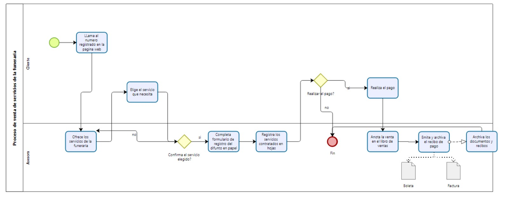

# Documentación de Procesos - Funeraria Los Álamos

## 1. Proceso de venta de servicios de la funeraria (antes de implementar el aplicativo web)

### Descripción del proceso:
La funeraria Los Álamos realizaba la venta de sus servicios mediante procesos manuales. Los clientes se comunicaban por teléfono para solicitar un servicio funerario, lo que generaba dependencias de herramientas básicas, como hojas de cálculo y registros manuales. A continuación, se detalla el proceso actual antes de la implementación del aplicativo web:

### Diagrama:

### Explicación del diagrama y notación BPMN utilizada:
- **Evento de inicio**: El proceso comienza cuando el cliente llama a la funeraria para solicitar un servicio. Se representa con un círculo verde.
- **Tareas**: Las tareas son representadas con rectángulos, tales como "Ofrecer los servicios", "Completar formulario" o "Anotar la venta". Estas acciones reflejan los pasos manuales que los empleados deben seguir para gestionar una venta.
- **Gateway (Decisiones)**: Los rombos amarillos representan puntos de decisión, como la confirmación del servicio elegido o la confirmación del pago. Dependiendo de la respuesta del cliente, el proceso puede continuar o finalizar.
- **Evento de fin**: El proceso finaliza cuando se completa la venta o si el cliente decide no continuar. Este evento está representado por un círculo rojo.

### Problemática:
Este enfoque de gestión presentaba varios desafíos:

- **Ineficiencia**: Los registros en papel y la comunicación telefónica hacían que el proceso fuera más lento y propenso a errores.
- **Capacidad de respuesta limitada**: La atención al cliente se dificultaba debido a la dependencia de herramientas manuales.
- **Competitividad**: La falta de digitalización afectaba la capacidad de la funeraria para competir con empresas que ya habían implementado soluciones digitales.

---

## 2. Proceso de venta de servicios funerarios (después de implementar el aplicativo web)

### Descripción del proceso:
Con la implementación del aplicativo web, la funeraria Los Álamos ha optimizado sus procesos, eliminando la dependencia de herramientas manuales y agilizando el proceso de ventas. Los clientes ahora pueden acceder a la plataforma en línea, visualizar los servicios, personalizarlos y realizar pagos de forma digital.

### Diagrama:

### Explicación del diagrama y notación BPMN utilizada:
- **Evento de inicio**: Representado por un círculo verde, indica que el cliente ingresa al aplicativo web.
- **Tareas**: Representadas por rectángulos, las tareas ahora son automatizadas. Ejemplos incluyen "Creación de cuenta", "Solicitud del servicio", "Asignación de asesor funerario" y "Personalización del servicio". Estas actividades eliminan la necesidad de que el asesor gestione manualmente la venta.
- **Gateway (Decisiones)**: Los rombos amarillos indican puntos de decisión como la confirmación de personalización o la solicitud del servicio. Esto permite que el cliente revise y decida de manera digital.
- **Flujos de secuencia**: Las flechas entre las tareas muestran el flujo del proceso, desde la creación de cuenta hasta el pago y la emisión del recibo.
- **Archivos**: Los iconos de documentos representan la generación automática de boletas o facturas según el tipo de pago.

### Solución implementada:
Con la implementación del aplicativo web:

- **Eficiencia**: Los procesos son más rápidos y libres de errores, ya que toda la información se almacena en el sistema.
- **Mejora en la capacidad de respuesta**: El cliente puede gestionar el servicio funerario directamente desde la web, sin depender de la disponibilidad del personal.
- **Competitividad**: La funeraria se ha posicionado mejor en el mercado, atrayendo nuevos clientes y reteniendo a los existentes mediante una solución digital moderna y accesible.
