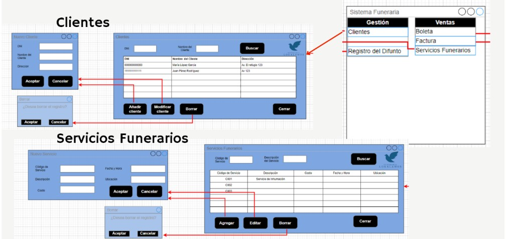
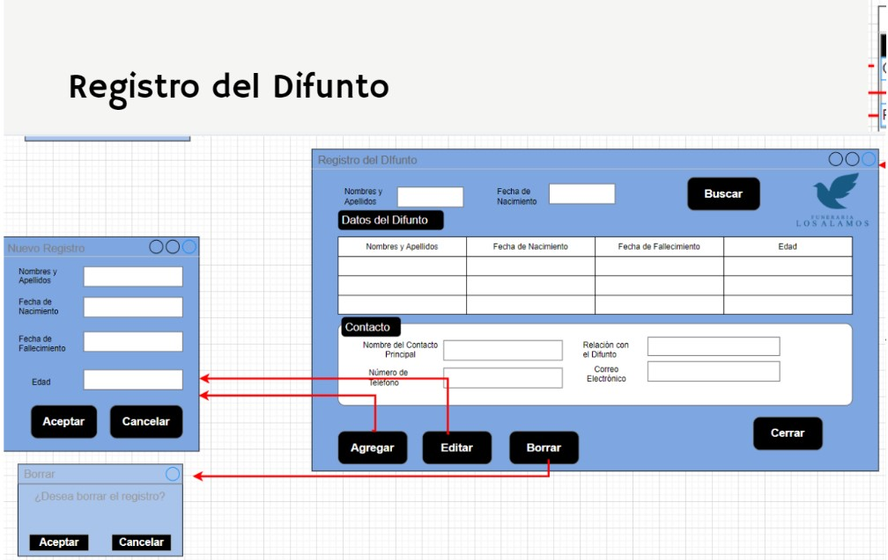
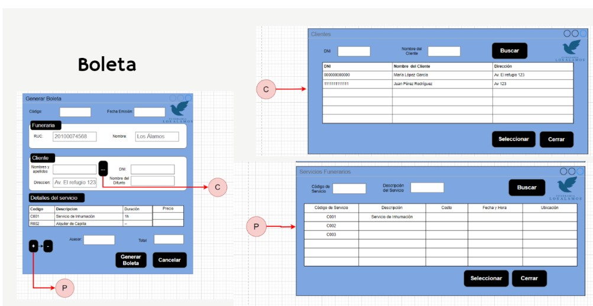
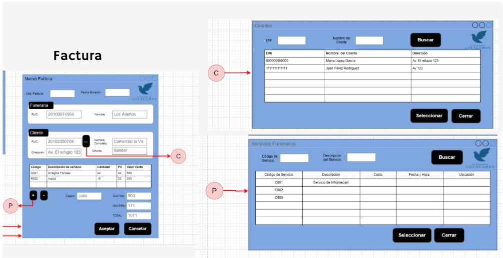

# Sistema Funerario "Los Álamos" - Documentación de Mockups

## Tabla de Contenidos
1. [Clientes](#clientes)
2. [Servicios Funerarios](#servicios-funerarios)
3. [Registro del Difunto](#registro-del-difunto)
4. [Boleta](#boleta)

---

## 1. Clientes

### Descripción:
El módulo de **Clientes** tiene como objetivo centralizar la información de los clientes que requieren servicios funerarios. Dado que es necesario mantener una base de datos actualizada de los clientes, este módulo permite registrar, modificar o eliminar clientes con facilidad. Este módulo es vital para la administración interna, ya que cualquier transacción o servicio está asociado a un cliente específico.

### Motivo de uso:
Este mockup es utilizado por los empleados de la funeraria para gestionar de forma rápida y eficiente los datos de sus clientes. La funeraria **"Los Álamos"** necesita tener un registro organizado de los clientes para gestionar los servicios adquiridos, generar boletas y realizar seguimiento de cada cliente. El propósito principal es mantener un historial y gestionar relaciones con los clientes de manera profesional y ordenada.

### Componentes:
- **Formulario Nuevo Cliente:**
  - **DNI**: Campo de texto para ingresar el Documento Nacional de Identidad del cliente.
  - **Nombre del Cliente**: Campo de texto para ingresar el nombre completo del cliente.
  - **Dirección**: Campo de texto para ingresar la dirección de residencia del cliente.
  - **Botones**:
    - `Aceptar`: Guarda los datos del cliente en la base de datos.
    - `Cancelar`: Cancela la operación actual y cierra el formulario.

- **Tabla de Clientes**:
  - Muestra la lista de los clientes registrados. Las columnas incluyen:
    - `DNI`: Documento de identificación del cliente.
    - `Nombre del Cliente`: Nombre completo del cliente.
    - `Dirección`: Dirección del cliente.

- **Acciones Disponibles**:
  - `Añadir Cliente`: Despliega el formulario para agregar un nuevo cliente.
  - `Modificar Cliente`: Permite seleccionar un cliente de la tabla y modificar sus datos.
  - `Borrar Cliente`: Elimina el cliente seleccionado después de confirmar la acción.

---

## 2. Servicios Funerarios

### Descripción:
El módulo de **Servicios Funerarios** está diseñado para la administración de los servicios que ofrece la funeraria. Los servicios pueden incluir desde alquiler de capilla hasta cremaciones y entierros, y deben ser gestionados de manera que estén disponibles cuando un cliente lo requiera. Este módulo permite agregar, modificar y eliminar servicios funerarios de manera eficiente.

### Motivo de uso:
Este mockup es esencial para que los administradores de la funeraria mantengan un registro actualizado de los servicios funerarios ofrecidos y sus respectivos costos. Los servicios pueden variar según la demanda y las circunstancias, por lo que es crucial que el personal tenga acceso rápido y directo a esta información para ofrecerla a los clientes, agilizando la generación de boletas y contratos.

### Componentes:
- **Formulario Nuevo Servicio:**
  - **Código del Servicio**: Campo de texto para ingresar un código único de identificación para cada servicio.
  - **Descripción**: Campo de texto para describir el tipo de servicio funerario (por ejemplo, "Cremación", "Alquiler de Capilla").
  - **Costo**: Campo numérico para ingresar el costo del servicio.
  - **Fecha y Hora**: Campos para especificar cuándo se prestará el servicio.
  - **Ubicación**: Campo de texto para la ubicación donde se brindará el servicio.
  - **Botones**:
    - `Aceptar`: Guarda los datos del servicio en la base de datos.
    - `Cancelar`: Cancela la operación y cierra el formulario.

- **Tabla de Servicios Funerarios**:
  - Muestra todos los servicios funerarios disponibles con las siguientes columnas:
    - `Código de Servicio`: Código único del servicio.
    - `Descripción`: Descripción del servicio.
    - `Costo`: Precio asociado al servicio.
    - `Fecha y Hora`: Fecha y hora programada para el servicio.
    - `Ubicación`: Lugar donde se llevará a cabo el servicio.

- **Acciones Disponibles**:
  - `Agregar`: Permite agregar un nuevo servicio funerario.
  - `Editar`: Permite modificar los detalles de un servicio seleccionado.
  - `Borrar`: Elimina un servicio del sistema después de la confirmación del usuario.

---

## 3. Registro del Difunto

### Descripción:
El módulo **Registro del Difunto** es una herramienta indispensable para registrar y organizar la información de los fallecidos que recibirán los servicios funerarios. Este módulo contiene todos los detalles relevantes sobre la persona fallecida, además de la información de contacto del familiar o responsable. El registro adecuado de esta información es vital para la logística y coordinación de los servicios funerarios.

### Motivo de uso:
El propósito de este mockup es gestionar los datos del difunto, ya que cada servicio funerario está asociado a una persona fallecida. Es crucial contar con un registro detallado de cada difunto para asegurar que los servicios proporcionados sean precisos y acordes con las solicitudes de los familiares. Este módulo permite tener una visión clara y completa del historial de fallecidos atendidos por la funeraria.

### Componentes:
- **Formulario Nuevo Registro**:
  - **Nombres y Apellidos**: Campo de texto para el nombre completo del difunto.
  - **Fecha de Nacimiento**: Campo de fecha para la fecha de nacimiento del difunto.
  - **Fecha de Fallecimiento**: Campo de fecha para la fecha de fallecimiento del difunto.
  - **Edad**: Campo calculado automáticamente o ingresado manualmente con la edad del difunto.
  - **Botones**:
    - `Aceptar`: Guarda el registro en la base de datos.
    - `Cancelar`: Cancela la operación y cierra el formulario.

- **Sección de Contacto**:
  - **Nombre del Contacto Principal**: Campo de texto para ingresar el nombre del familiar o responsable.
  - **Número de Teléfono**: Campo de texto para el número de contacto.
  - **Relación con el Difunto**: Campo de texto para especificar la relación (por ejemplo, "Hijo", "Esposo").
  - **Correo Electrónico**: Campo de texto para el correo electrónico de contacto.

- **Tabla de Registros**:
  - Muestra los registros existentes en el sistema, con columnas que incluyen:
    - `Nombres y Apellidos`: Nombre del difunto.
    - `Fecha de Nacimiento`: Fecha de nacimiento del difunto.
    - `Fecha de Fallecimiento`: Fecha de fallecimiento.
    - `Edad`: Edad del difunto.

- **Acciones Disponibles**:
  - `Agregar`: Permite ingresar un nuevo registro de difunto.
  - `Editar`: Modifica un registro existente seleccionado.
  - `Borrar`: Elimina un registro tras confirmación.

---

## 4. Boleta

### Descripción:
El módulo de **Boleta** permite la emisión de recibos por los servicios funerarios contratados por los clientes. Incluye detalles importantes sobre la funeraria, el cliente, el difunto y los servicios solicitados. La boleta se genera como documento formal y sirve para registrar la transacción entre la funeraria y el cliente.

### Motivo de uso:
El mockup de **Boleta** es fundamental para cerrar una transacción de servicio funerario. Proporciona una manera clara y formal de comunicar el costo de los servicios proporcionados, detallando cada uno de los servicios contratados. Además, asegura que la funeraria puede emitir un documento válido y legalmente reconocido para sus clientes.

### Componentes:
- **Formulario Generar Boleta**:
  - **Código**: Campo de texto para ingresar el código único de la boleta.
  - **Fecha de Emisión**: Campo de fecha para registrar cuándo se emitió la boleta.

  - **Datos de la Funeraria**:
    - **RUC**: Campo de texto para el número de RUC de la funeraria.
    - **Nombre**: Campo de texto para el nombre comercial de la funeraria.

  - **Datos del Cliente**:
    - **Nombres y Apellidos**: Campo de texto para ingresar el nombre completo del cliente.
    - **DNI**: Campo de texto para ingresar el número de identificación del cliente.
    - **Dirección**: Campo de texto para ingresar la dirección del cliente.
    - **Nombre del Difunto**: Campo de texto para asociar al difunto relacionado con el cliente.

  - **Detalles del Servicio**:
    - Tabla que muestra los servicios adquiridos con las siguientes columnas:
      - **Código**: Código del servicio funerario.
      - **Descripción**: Descripción del servicio proporcionado.
      - **Duración**: Duración del servicio (si es aplicable).
     

## 4. Factura

## Descripción:
La pantalla de **Factura** es la interfaz principal donde se emiten las facturas por los servicios y productos funerarios adquiridos. Permite capturar información del cliente, los productos o servicios, y realizar los cálculos automáticos de subtotales, impuestos y el total final de la factura. También facilita la gestión y el seguimiento de los datos asociados a cada venta.

## Motivo de uso:
Esta pantalla es utilizada para **generar facturas** cuando un cliente adquiere un servicio funerario o un producto relacionado. Permite a la funeraria mantener un registro formal y estructurado de las transacciones comerciales, asegurando que todos los detalles de la venta estén documentados correctamente. Además, realiza automáticamente los cálculos de subtotales y el IGV (Impuesto General a las Ventas), facilitando el proceso de cobro.

### Componentes:

### 1. **Cabecera**
   - **Cod. Factura**: Campo para ingresar o generar automáticamente el código único de la factura.
   - **Fecha Emisión**: Campo para registrar la fecha en que se emite la factura.

### 2. **Sección Funeraria**
   - **RUC**: Campo que muestra el RUC (Registro Único de Contribuyentes) de la funeraria.
   - **Nombre**: Campo que muestra el nombre de la funeraria (Los Alamos).

### 3. **Sección Cliente**
   - **RUC del Cliente**: Campo para ingresar el RUC del cliente que está adquiriendo el servicio.
   - **Dirección**: Campo para ingresar la dirección del cliente.
   - **Nombre Completo del Cliente**: Campo para ingresar el nombre del cliente.
   - **Difunto**: Campo donde se ingresa el nombre del difunto al cual se asocia el servicio funerario.

### 4. **Sección de Servicios**
   - **Código del Servicio/Producto**: Código único que identifica el servicio o producto ofrecido.
   - **Descripción del Servicio**: Descripción detallada del servicio o producto (ejemplo: "Arreglo floral", "Ataúd").
   - **Cantidad**: Campo donde se ingresa la cantidad de unidades adquiridas de cada servicio o producto.
   - **Precio Unitario (PU)**: Precio unitario por cada servicio o producto.
   - **Valor Venta**: El valor total de la venta de cada ítem, calculado como **Cantidad x Precio Unitario**.

### 5. **Botones de Agregar/Eliminar Servicio**
   - **Botón (+)**: Permite agregar un nuevo servicio o producto a la factura.
   - **Botón (-)**: Permite eliminar un servicio o producto previamente añadido a la factura.

### 6. **Sección Totales**
   - **Cajero**: Campo para registrar el nombre del cajero encargado de emitir la factura.
   - **Subtotal**: Campo que muestra el total de los servicios/productos antes de aplicar impuestos.
   - **IGV (19%)**: Impuesto General a las Ventas, calculado automáticamente sobre el subtotal.
   - **Total**: El total final a pagar, que incluye el subtotal más el impuesto (IGV).

### 7. **Botones de Acción**
   - **Aceptar**: Botón que permite confirmar la creación de la factura y registrar la venta.
   - **Cancelar**: Botón que permite cancelar la operación y no generar la factura.
